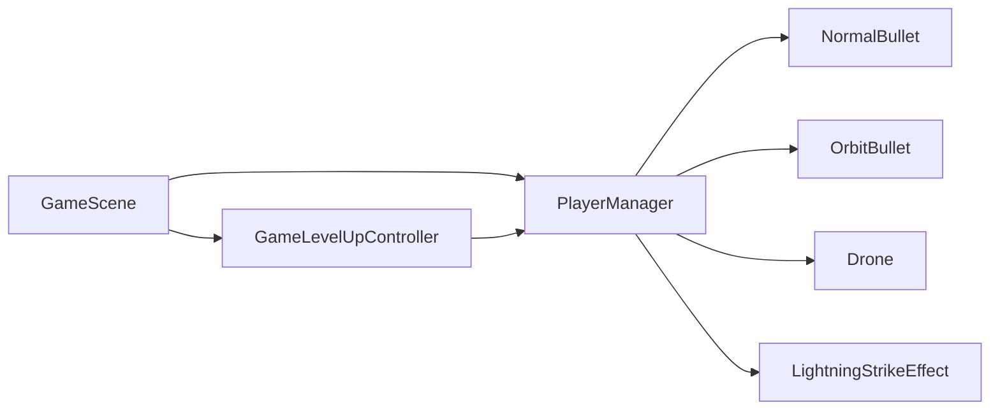
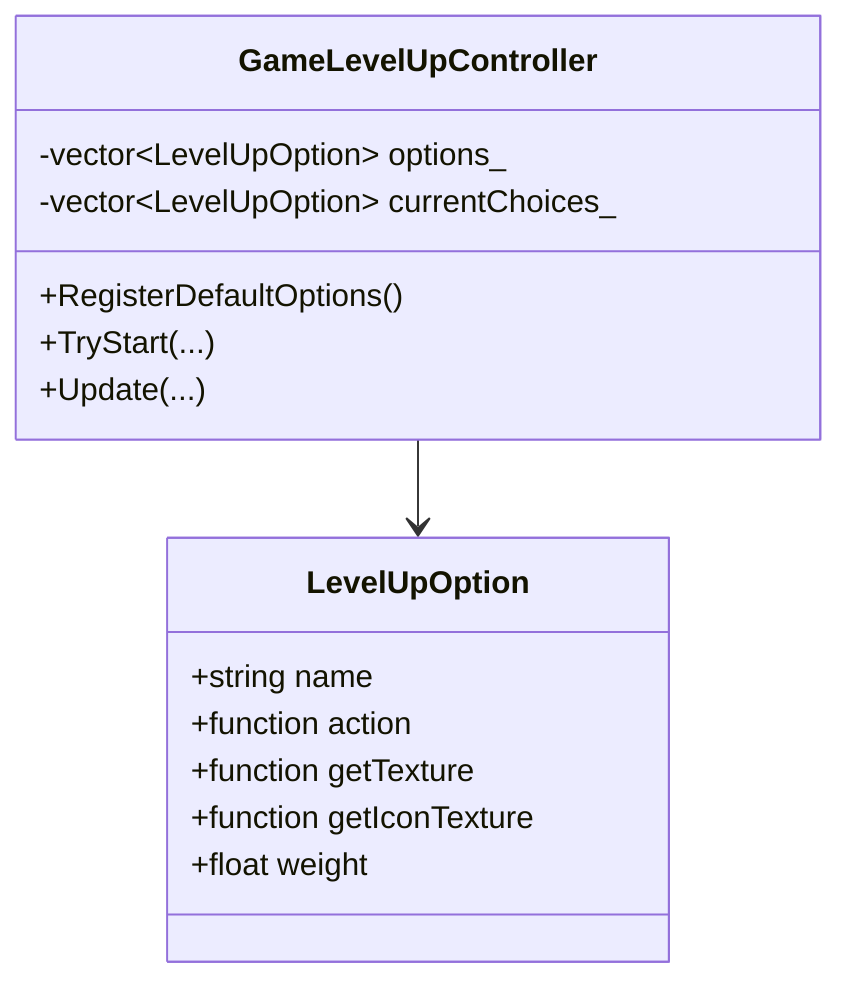
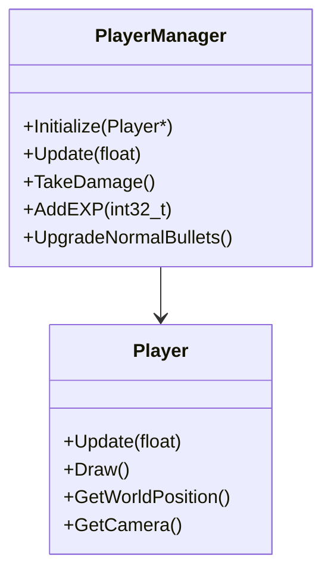
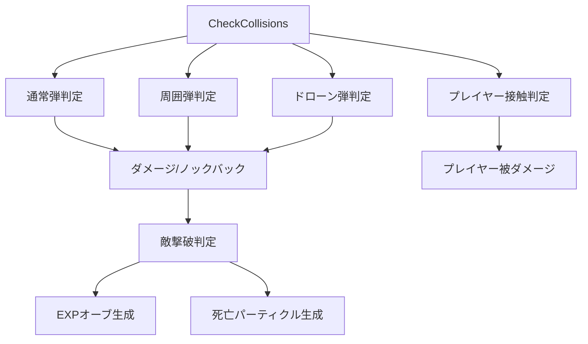
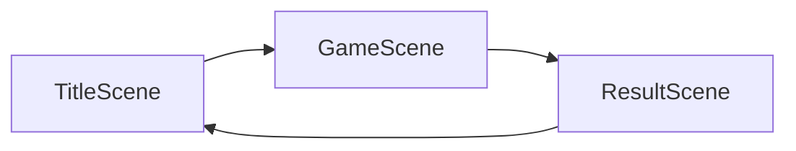
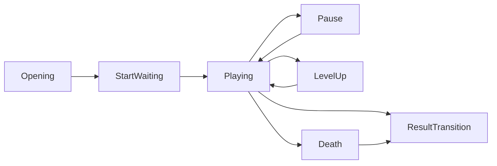
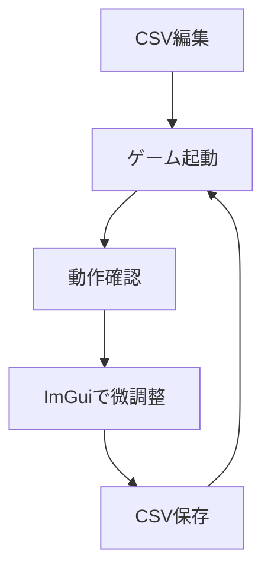

# プログラム説明資料 原稿

- 対象作品: DirectXGame
- スライド比率: 16:9
- 想定解像度: 1920 x 1080
- 主軸: 武器システム
- サブ: シーン管理 / 敵管理 / プレイヤー管理 / データ調整基盤
- 想定枚数: 10枚

---

## スライド1: タイトル

### レイアウト
- 背景全面にゲームスクリーンショットを1枚配置し、上から黒の半透明オーバーレイを重ねる
- 左中央にタイトルを大きく配置
- 左下に氏名
- 右下に小さく作品名または所属欄を置いてもよい

### 掲載文

# プログラム説明資料

大久保拓（オオクボタク）

### 話す内容
- 本資料では、二軸3Dシューティングの実装について、特に武器システムを中心にコード面から説明する。

---

## スライド2: 目次

### レイアウト
- 左 60% に目次
- 右 40% に「主軸」と「補助」の2つの情報カード

### 掲載文

# 目次

1. プログラム概要
2. 武器システム全体像
3. レベルアップ選択肢をラムダ式で管理した理由
4. 武器成長を PlayerManager に集約した理由
5. プレイヤー本体と管理クラスの分離
6. EnemyManager による戦闘処理の集約
7. 空間分割による当たり判定負荷の削減
8. シーン管理とゲーム進行制御
9. CSV と ImGui による調整基盤
10. まとめ

### 右側カード

**主軸**
- 武器システム
- レベルアップ設計
- ラムダ式による選択肢管理

**補助**
- シーン管理
- 敵管理
- データ外部化

---

## スライド3: プログラム概要

### レイアウト
- 左上 45%: 基本情報カード
- 右上 25%: GitHub リンク欄
- 右上 25%: QR コード欄
- 下半分: スクリーンショット3枚を横並び
- 各スクリーンショットの下に1行説明

### 掲載文

# プログラム概要

### 基本情報
- ジャンル: 二軸3Dシューティング
- 製作期間: 2025年7月 ～ 2026年4月（制作中）
- 開発人数: 1人
- 担当箇所: コード全般

### GitHub / QR
- GitHub: `ここにURLを記載`
- QRコード: `ここに画像を配置`

### ゲーム説明文
プレイヤーを中心に敵が湧き続ける構成とし、撃破で得た経験値によるレベルアップで武器構成を変えながら生存時間を伸ばす二軸3Dシューティングである。  
武器の追加・強化によってプレイ感が変化する点を、ゲーム体験の中心として設計している。

### スクリーンショット欄
- `[スクリーンショット1: 通常プレイ]`
  - プレイヤーを中心に敵をさばきながら生存する基本のゲーム画面
- `[スクリーンショット2: レベルアップ画面]`
  - プレイ中に武器や能力を選択し、ビルドを変化させる
- `[スクリーンショット3: 複数武器運用時]`
  - 武器構成の成長によって攻撃範囲や殲滅力が変化する

---

## スライド4: 武器システム全体像

### このスライドで伝えること
- 武器システムは単独の1クラスではなく、`GameLevelUpController` と `PlayerManager` を中心に、UI と実行処理を分離して構成している。

### なぜ実装したか
- プレイ中に武器が増えたり強化されたりするゲーム性を成立させるため
- 「選ぶ画面」と「実際に強くなる処理」を分け、武器追加時の修正箇所を限定したかったため

### どうしてこの方法なのか
- レベルアップ選択は `GameLevelUpController`
- 実際の武器性能や生成は `PlayerManager`
- 各武器は `NormalBullet` / `OrbitBullet` / `Drone` / `Lightning` のように個別クラス

### 実装してどうなったか
- UI側の選択ロジックと、戦闘中の実処理を分離できた
- 新武器や新強化の追加時に、変更箇所を局所化できた
- プレイ中の見た目と内部ロジックの責務が明確になった

### レイアウト
- 左 55%: 図解
- 右 45%: 上記3ブロックを縦に配置

### 図解



### コード抜粋候補
- [scene/game/GameLevelUpController.h](C:/Users/k023g/source/repos/就職作品/DirectXGame/DirectXGame/scene/game/GameLevelUpController.h:16)
- [player/core/PlayerManager.h](C:/Users/k023g/source/repos/就職作品/DirectXGame/DirectXGame/player/core/PlayerManager.h:112)

### スライド用一言
武器システムは、選択UI、成長管理、実際の攻撃処理を分けて設計することで、拡張しやすさを優先した。

---

## スライド5: レベルアップ選択肢をラムダ式で管理した理由

### このスライドで伝えること
- この資料のメインアピール
- 武器や能力の選択肢を「処理」と「表示」をまとめたデータとして扱っている点

### なぜ実装したか
- レベルアップ候補ごとに、以下をひとまとまりで管理したかったため
- 選ばれたときの処理
- 表示する画像
- 表示するアイコン

### どうしてこの方法なのか
- `LevelUpOption` に `action` / `getTexture` / `getIconTexture` を持たせた
- 各候補を `std::function` とラムダ式で登録した
- これにより、候補追加時に大きな `switch` 文を増やさずに済む

### 実装してどうなったか
- 選択肢を「データとして扱える」構造になった
- UI生成と強化処理を対応付けやすくなった
- 武器追加時は `options_.push_back(...)` を追加するだけで済む形に近づいた

### レイアウト
- 上半分: 文章
- 下半分左: クラス図
- 下半分右: 実コード抜粋

### 図解



### コード抜粋

```cpp
struct LevelUpOption {
    std::string name;
    std::function<void(PlayerManager*)> action;
    std::function<uint32_t(PlayerManager*)> getTexture;
    std::function<uint32_t(PlayerManager*)> getIconTexture;
    float weight = 1.0f;
};
```

```cpp
options_.push_back({
    "通常弾強化",
    [](PlayerManager* pm) { pm->UpgradeNormalBullets(); },
    [](PlayerManager* pm) { return GetNormalLevelUpTexture(pm); },
    [](PlayerManager*) { return TextureManager::Load("ui/game/normal/icon.png"); },
    2.0f
});
```

### 出典コード
- [scene/game/GameLevelUpController.h](C:/Users/k023g/source/repos/就職作品/DirectXGame/DirectXGame/scene/game/GameLevelUpController.h:16)
- [scene/game/GameLevelUpController.cpp](C:/Users/k023g/source/repos/就職作品/DirectXGame/DirectXGame/scene/game/GameLevelUpController.cpp:247)

### スライド用まとめ文
レベルアップ候補をラムダ式で登録することで、処理内容とUI表示をひとまとまりのデータとして管理できるようにした。  
その結果、武器追加時に分岐を書き散らさず、拡張しやすい構造になった。

---

## スライド6: 武器成長を PlayerManager に集約した理由

### なぜ実装したか
- 武器ごとのレベル、攻撃力、発射間隔、弾数、半径などを一元管理したかったため
- プレイヤー本体にすべて持たせると、移動やカメラ処理まで含めて肥大化するため

### どうしてこの方法なのか
- `PlayerManager` に HP / EXP / レベル / 武器群 / 成長処理を集約した
- `UpgradeNormalBullets`、`AddOrbitBullets`、`UpgradeDrone`、`AddLightning` など、武器追加と成長を責務としてまとめた
- 武器の見た目や挙動は個別クラスに任せ、成長ルールだけ `PlayerManager` に置いた

### 実装してどうなったか
- 成長ルールが1箇所に集まり、ゲームバランスを把握しやすくなった
- レベルアップUIから見ても、適用先が `PlayerManager` に統一された
- 武器ごとの差異を保ちながら、成長管理の入口を共通化できた

### レイアウト
- 左 50%: 武器ごとの成長表
- 右 50%: 説明文 + コード抜粋

### 図解

| 武器 | 初期追加 | 強化内容 |
| --- | --- | --- |
| 通常弾 | 初期所持 | 弾数、速度、貫通、発射間隔 |
| 周囲弾 | 取得で解禁 | 個数、半径、回転速度、ヒット間隔 |
| ドローン | 取得で解禁 | 同時発射数、威力、貫通、発射間隔 |
| ライトニング | 取得で解禁 | 範囲、威力、落雷数、間隔 |

### コード抜粋

```cpp
void PlayerManager::UpgradeNormalBullets() {
    if (normalBulletLevel_ >= kNormalBulletMaxLevel) {
        return;
    }

    ++normalBulletLevel_;
    switch (normalBulletLevel_) {
    case 2:
        normalBulletAmount_ = static_cast<int32_t>(
            GetWeaponUpgradeSetting("normal.lv2.amount", 2.0f));
        break;
    case 7:
        normalBulletPierceCount_ = static_cast<int32_t>(
            GetWeaponUpgradeSetting("normal.lv7.pierceCount", 2.0f));
        break;
    }
}
```

### 出典コード
- [player/core/PlayerManager.cpp](C:/Users/k023g/source/repos/就職作品/DirectXGame/DirectXGame/player/core/PlayerManager.cpp:299)
- [player/core/PlayerManager.cpp](C:/Users/k023g/source/repos/就職作品/DirectXGame/DirectXGame/player/core/PlayerManager.cpp:337)
- [player/core/PlayerManager.cpp](C:/Users/k023g/source/repos/就職作品/DirectXGame/DirectXGame/player/core/PlayerManager.cpp:417)
- [player/core/PlayerManager.cpp](C:/Users/k023g/source/repos/就職作品/DirectXGame/DirectXGame/player/core/PlayerManager.cpp:456)

### スライド用まとめ文
武器成長のルールを `PlayerManager` に集約することで、プレイヤーの成長全体を一箇所で制御できる構造にした。  
結果として、バランス調整と機能追加の両方がやりやすくなった。

---

## スライド7: プレイヤー本体と管理クラスを分離した理由

### なぜ実装したか
- プレイヤーの移動、向き、カメラ更新と、HP・経験値・武器管理は役割が異なるため
- 1クラスに詰め込むと責務が混ざり、保守しづらくなるため

### どうしてこの方法なのか
- `Player` は移動、照準、描画、カメラのみ担当
- `PlayerManager` は HP、EXP、レベルアップ、武器、無敵時間を担当

### 実装してどうなったか
- 見た目の制御とゲームルールを分離できた
- 武器や成長に手を入れても、移動処理に影響を出しにくくなった
- デバッグ時に、どこを見るべきかが分かりやすくなった

### レイアウト
- 左半分: クラス図
- 右半分: 箇条書き + コード抜粋

### 図解



### コード抜粋候補
- [player/core/Player.h](C:/Users/k023g/source/repos/就職作品/DirectXGame/DirectXGame/player/core/Player.h:10)
- [player/core/PlayerManager.h](C:/Users/k023g/source/repos/就職作品/DirectXGame/DirectXGame/player/core/PlayerManager.h:25)

### スライド用まとめ文
プレイヤーの表示と移動を `Player`、成長と戦闘状態を `PlayerManager` に分離することで、責務の整理と保守性向上を両立した。

---

## スライド8: EnemyManager による戦闘処理の集約

### なぜ実装したか
- 弾、周囲弾、ドローン弾、プレイヤー接触と、複数種類の当たり判定が存在するため
- ダメージ、ノックバック、撃破、EXP生成を分散させると整合性が崩れやすいため

### どうしてこの方法なのか
- 当たり判定と撃破後処理を `EnemyManager` に集約した
- `CheckNormalBulletCollisions`、`CheckOrbitBulletCollisions`、`CheckDroneBulletCollisions`、`CheckPlayerCollisions` を分けつつ、入口は `CheckCollisions()` にまとめた

### 実装してどうなったか
- 戦闘ロジックの流れを1箇所で追えるようになった
- 武器が増えても、敵への反映処理を同じ場所で管理できる
- ヒット演出、撃破演出、EXPドロップまで一貫した処理にできた

### レイアウト
- 左 55%: 処理フロー図
- 右 45%: 説明文

### 図解



### 出典コード
- [enemy/EnemyManager.cpp](C:/Users/k023g/source/repos/就職作品/DirectXGame/DirectXGame/enemy/EnemyManager.cpp:371)
- [enemy/EnemyManager.cpp](C:/Users/k023g/source/repos/就職作品/DirectXGame/DirectXGame/enemy/EnemyManager.cpp:402)
- [enemy/EnemyManager.cpp](C:/Users/k023g/source/repos/就職作品/DirectXGame/DirectXGame/enemy/EnemyManager.cpp:430)
- [enemy/EnemyManager.cpp](C:/Users/k023g/source/repos/就職作品/DirectXGame/DirectXGame/enemy/EnemyManager.cpp:500)

### スライド用まとめ文
戦闘処理を `EnemyManager` に集約することで、複数武器が存在しても処理の一貫性を保ちやすい構造にした。

---

## スライド9: 空間分割による当たり判定負荷の削減

### なぜ実装したか
- 敵数が増えるゲームで、全敵に対する総当たり判定は処理量が増えやすいため

### どうしてこの方法なのか
- 敵をセルに分割して保持し、近いセルの敵だけを取得する方式を採用した
- `BuildActiveEnemySpatialMap()` で配置を構築し、`CollectNearbyEnemies()` で近傍候補だけを取り出す

### 実装してどうなったか
- 当たり判定対象を近距離の敵に絞れるようになった
- 敵数が増えても、処理量の増え方を抑えられる構造になった
- 分離処理にも同じ近傍探索を使えるため、実装の再利用性も上がった

### レイアウト
- 左半分: 空間分割の模式図
- 右半分: 説明文 + 短いコード抜粋

### 図解


### コード抜粋

```cpp
using EnemyCellMap = std::unordered_map<int64_t, std::vector<Enemy*>>;
static constexpr float kSpatialCellSize = 8.0f;

void EnemyManager::BuildActiveEnemySpatialMap(
    EnemyCellMap& outMap,
    std::vector<Enemy*>& activeEnemies) const;

void EnemyManager::CollectNearbyEnemies(
    const EnemyCellMap& spatialMap,
    const KamataEngine::Vector3& center,
    float radius,
    std::vector<Enemy*>& outEnemies) const;
```

### 出典コード
- [enemy/EnemyManager.h](C:/Users/k023g/source/repos/就職作品/DirectXGame/DirectXGame/enemy/EnemyManager.h:99)
- [enemy/EnemyManager.cpp](C:/Users/k023g/source/repos/就職作品/DirectXGame/DirectXGame/enemy/EnemyManager.cpp:258)
- [enemy/EnemyManager.cpp](C:/Users/k023g/source/repos/就職作品/DirectXGame/DirectXGame/enemy/EnemyManager.cpp:275)

### スライド用まとめ文
敵をセル分割して近い対象だけを調べることで、敵数が多い状況でも当たり判定負荷を抑えられるようにした。

---

## スライド10: シーン管理とゲーム進行制御

### なぜ実装したか
- タイトル、ゲーム、リザルトで初期化・更新・描画の流れを共通化したかったため
- ゲーム中も開始演出、ポーズ、レベルアップ、死亡、結果遷移を整理したかったため

### どうしてこの方法なのか
- `IScene` を基底クラスとし、`SceneManager` で生成と切り替えを管理した
- `GameScene` 内では `GameFlowState` を使って進行状態を明示的に分けた

### 実装してどうなったか
- 画面遷移の責務が明確になった
- 状態ごとに更新を止めるべき場面を制御しやすくなった
- 大きなゲームループでも、進行の見通しを保てた

### レイアウト
- 上半分: シーン遷移図
- 下半分: `GameScene` 状態遷移図

### 図解1



### 図解2



### 出典コード
- [core/main.cpp](C:/Users/k023g/source/repos/就職作品/DirectXGame/DirectXGame/core/main.cpp:14)
- [scene/core/SceneManager.cpp](C:/Users/k023g/source/repos/就職作品/DirectXGame/DirectXGame/scene/core/SceneManager.cpp:38)
- [scene/game/GameScene.h](C:/Users/k023g/source/repos/就職作品/DirectXGame/DirectXGame/scene/game/GameScene.h:70)

### スライド用まとめ文
シーン管理とゲーム進行制御を分けて整理することで、画面遷移とプレイ中状態の両方を管理しやすくした。

---

## スライド11: CSV と ImGui による調整基盤

### なぜ実装したか
- 武器性能、敵パラメータ、UI配置の調整をコード修正なしで回したかったため
- 制作中の試行回数を増やし、実装と調整を分離したかったため

### どうしてこの方法なのか
- `Resources/data` にプレイヤー、敵、スポーン、レベルアップ重み、UIレイアウトをCSVで保存した
- デバッグ時は ImGui から配置を変更し、そのままCSVに保存できるようにした

### 実装してどうなったか
- バランス調整の反復がしやすくなった
- UIの微調整をコード修正なしで進められるようになった
- 制作工程としても、実装と調整を分業しやすい構造になった

### レイアウト
- 左 50%: 調整フロー図
- 右 50%: CSV と ImGui の説明

### 図解



### 出典コード
- [player/core/PlayerManager.cpp](C:/Users/k023g/source/repos/就職作品/DirectXGame/DirectXGame/player/core/PlayerManager.cpp:16)
- [enemy/EnemyManager.cpp](C:/Users/k023g/source/repos/就職作品/DirectXGame/DirectXGame/enemy/EnemyManager.cpp:35)
- [scene/title/TitleScene.cpp](C:/Users/k023g/source/repos/就職作品/DirectXGame/DirectXGame/scene/title/TitleScene.cpp:378)
- [scene/game/GameLevelUpController.cpp](C:/Users/k023g/source/repos/就職作品/DirectXGame/DirectXGame/scene/game/GameLevelUpController.cpp:496)

### スライド用まとめ文
CSV と ImGui を組み合わせることで、コード変更を伴わない調整ループを作り、制作効率を高めた。

---

## スライド12: まとめ

### レイアウト
- 左 60%: まとめ3点
- 右 40%: 武器システム図の再掲またはゲーム画面

### 掲載文

# まとめ

- 武器システムは、レベルアップ選択UIと成長処理を分離することで拡張しやすい構造にした
- ラムダ式を用いて選択肢をデータとして扱い、処理と表示の対応付けを簡潔にした
- その土台として、プレイヤー管理、敵管理、シーン管理、CSV調整基盤を整理して実装した

### 発表の締め文
主軸である武器システムは、ゲーム体験の中心であると同時に、設計面でも最も工夫した部分である。  
選択肢管理、成長処理、戦闘処理を役割ごとに分けたことで、機能追加と調整の両方に対応しやすい構造を実現した。

---

## そのまま貼れる補足素材

### GitHub欄テンプレート

```text
GitHub: https://github.com/xxxxxxxx/DirectXGame
```

### QRコード欄テンプレート

```text
[QRコード画像をここに配置]
```

### スクリーンショット欄テンプレート

```text
[スクリーンショット1]
通常プレイ画面

[スクリーンショット2]
レベルアップ選択画面

[スクリーンショット3]
複数武器取得後の戦闘画面
```

### 口頭で強調するとよい一文

```text
武器システムでは、選択肢ごとの処理と表示をラムダ式でまとめて登録することで、
武器追加時に分岐を書き散らさずに拡張できるようにした。
```
