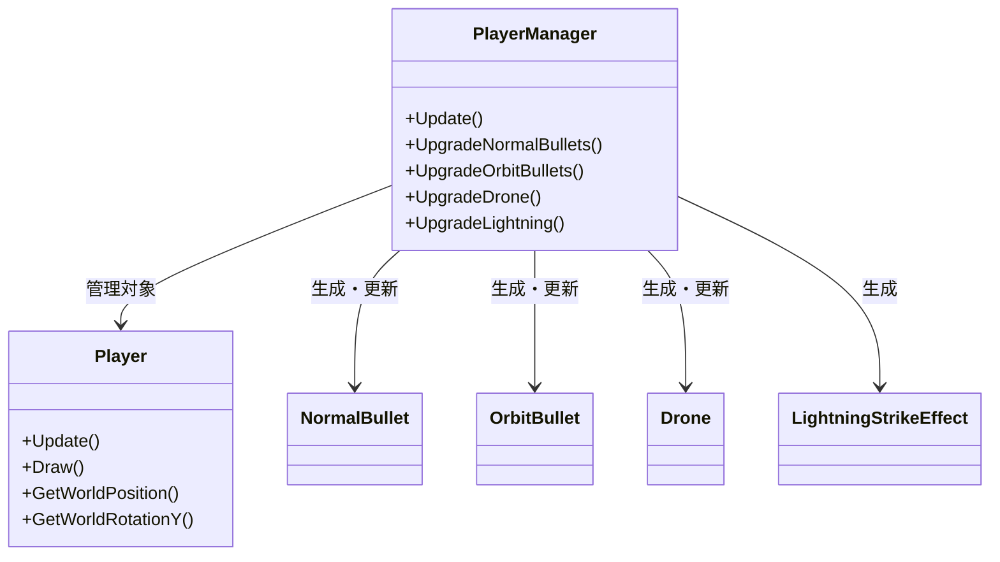
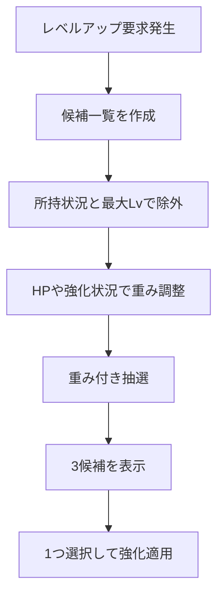
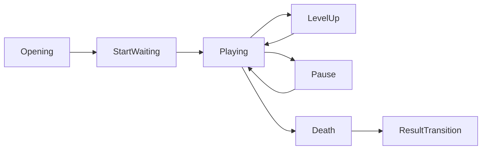
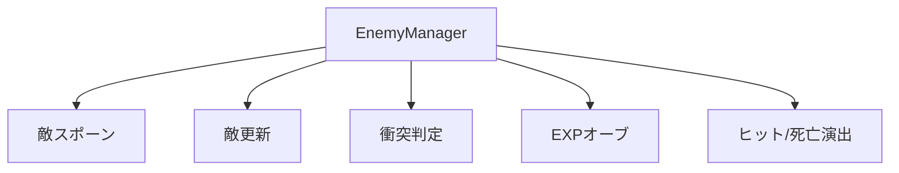

# プログラム説明資料 原稿

- 対象作品: DirectXGame
- スライド比率: 16:9
- 主軸: 武器システム
- サブ: シーン管理 / 敵管理 / データ調整基盤
- 想定枚数: 8枚

---

## スライド1: タイトル

### レイアウト
- 背景はシンプルな無地か、ゲーム画面を薄く暗くしたものを全面配置
- 左中央にタイトルを大きく配置
- 左下に氏名
- 右側に小さめのアクセント図形を置いて情報量を絞る

### 掲載文
**プログラム説明資料**

大久保拓（オオクボタク）

### 補足
- タイトル画面のスクリーンショットを薄く敷くと作品名と内容が直感的に伝わる
- 1枚目は情報を詰めすぎず、見出しとして使う

---

## スライド2: 目次

### レイアウト
- 左に箇条書きの目次
- 右に「主軸」と「補助」の2ブロック

### 掲載文
## 目次

1. プログラム概要  
2. 武器システムの構造  
3. レベルアップ候補の動的制御  
4. 武器成長による挙動変化  
5. 主軸を支える実装  
6. まとめ  

### スライド用の説明文
この資料では、まず作品全体を簡潔に説明し、その上で主軸である武器システムを中心に設計と実装を紹介する。  
後半では、武器システムを成立させるために必要だったシーン管理、敵管理、データ調整基盤も補足として説明する。

### 強調ポイント
- 主軸: 武器システム
- 補助: シーン管理 / 敵管理 / CSV調整

---

## スライド3: プログラム概要

### レイアウト
- 左上: 基本情報を1つの情報カードにまとめる
- 右上: GitHubリンク欄とQRコード欄
- 下半分: スクリーンショット3枚を横並び
- 各スクリーンショットの下に1行説明

### 掲載文
## プログラム概要

### 基本情報
- ジャンル: 二軸3Dシューティング
- 製作期間: 2025年7月 ～ 2026年4月（制作中）
- 開発人数: 1人
- 担当箇所: コード全般

### GitHub / QR
- GitHub: `ここにURLを記載`
- QRコード: `ここに画像を配置`

### ゲーム内容説明文
プレイヤーを中心に敵が湧き続ける構成とし、撃破で得た経験値によるレベルアップで武器構成を変えながら生存時間を伸ばす二軸3Dシューティングである。  
単に敵を倒すだけではなく、プレイ中に武器ビルドが変化していくことをゲーム体験の中心に置いている。

### スクリーンショット欄
- スクリーンショットA: タイトル画面
  - 説明: タイトル、ガイド、開始導線を整理し、最初に遊び方が伝わる構成にしている。
- スクリーンショットB: 通常プレイ画面
  - 説明: プレイヤー移動、敵の包囲、武器攻撃、HUDを同時に確認できる基本画面である。
- スクリーンショットC: レベルアップまたはポーズ画面
  - 説明: レベルアップ時にビルド選択を行い、プレイ中に戦い方が変化する点が本作の特徴である。

---

## スライド4: 武器システムの構造

### このスライドで答えること
- なぜ実装したか
- どうしてこの方法なのか
- 実装してどうなったか

### レイアウト
- 左: 説明文
- 右: クラス図
- 下: 短いコード抜粋

### スライド用本文
### なぜ実装したか
単発のアクションだけではプレイ内容が単調になりやすいため、プレイ中に武器構成が変化し、戦い方そのものが変わる体験を作りたかった。  
そのため、本作では武器システムをゲーム性の中心に置いた。

### どうしてこの方法なのか
武器ごとに挙動が異なるため、通常弾、周囲弾、ドローン、ライトニングを個別クラスに分けた。  
一方で、武器の取得状態、内部レベル、ダメージ、強化内容は `PlayerManager` に集約し、プレイヤー本体の座標・見た目と分離した。

### 実装してどうなったか
新しい武器を追加するときは、武器クラスの追加と `PlayerManager` の管理項目追加で済む構造になった。  
機能を分割したことで、武器ごとの差分を作りやすく、拡張しやすい構成にできた。

### 図解案


### コード抜粋
出典: [player/core/PlayerManager.cpp](</C:/Users/k023g/source/repos/就職作品/DirectXGame/DirectXGame/player/core/PlayerManager.cpp>)

```cpp
void PlayerManager::Update(float deltaTime) {
    UpdateInvincibility(deltaTime);
    UpdateNormalBullets(deltaTime);
    UpdateOrbitBullets(deltaTime);
    UpdateDrone(deltaTime);
    UpdateLightning(deltaTime);
    UpdateEffects(deltaTime);
}
```

### 話すときの要点
- 武器の見た目と発射処理は個別
- 強化状態とビルド状態は `PlayerManager` に集約
- 責務分割により、武器追加時の影響範囲を抑えている

---

## スライド5: レベルアップ候補の動的制御

### レイアウト
- 左: 説明文
- 右: フローチャート
- 下: 候補制御のコード抜粋

### スライド用本文
### なぜ実装したか
武器を固定順で強化すると毎回同じプレイになりやすく、ビルドを考える面白さが薄くなる。  
そのため、プレイヤーの状況に応じて候補が変わるレベルアップ制御を入れた。

### どうしてこの方法なのか
候補を固定で並べるのではなく、現在の武器所持状況、武器レベル、HP状況に応じて候補を除外し、重みを変える方式にした。  
未所持武器は解禁候補、最大レベル到達武器は除外、HP低下時は回復候補を出やすくしている。

### 実装してどうなったか
毎回異なる成長ルートが発生しやすくなり、プレイヤーが状況に応じて選択する余地が生まれた。  
また、重みをCSVで調整できるため、ゲームバランス調整もしやすくなった。

### 図解案


### コード抜粋
出典: [scene/game/GameLevelUpController.cpp](</C:/Users/k023g/source/repos/就職作品/DirectXGame/DirectXGame/scene/game/GameLevelUpController.cpp>)

```cpp
if (option.name == "HP回復") {
    if (playerManager->GetHP() >= playerManager->GetMaxHP()) {
        continue;
    }

    const float hpRatio =
        static_cast<float>(playerManager->GetHP()) /
        static_cast<float>((std::max)(1, playerManager->GetMaxHP()));
    adjusted.weight = hpRatio <= 0.34f ? 2.5f :
                      (hpRatio <= 0.67f ? 1.4f : 0.7f);
}
```

### 話すときの要点
- 固定候補ではなく、プレイヤー状態で候補を変える
- 「今欲しい選択肢」が出やすい
- 重みをコードとCSVの両方で扱えるため調整しやすい

---

## スライド6: 武器成長で挙動そのものを変える

### レイアウト
- 左: 通常弾 / 周囲弾 / ドローン の成長表
- 右: 1つの武器を深掘りする図解
- 下: 実コード抜粋

### スライド用本文
### なぜ実装したか
単純な攻撃力上昇だけでは成長の実感が弱いため、強化で武器の挙動自体が変わるようにしたかった。  
特に本作では、プレイヤーが見た目でも性能差を理解できることを重視した。

### どうしてこの方法なのか
各武器に内部レベルを持たせ、レベルごとに伸ばすパラメータを分離した。  
通常弾は発射数、弾速、貫通。周囲弾は弾数、半径、回転速度、サイズ。ドローンは同時発射数、発射間隔、ダメージ、貫通とした。

### 実装してどうなったか
強化のたびに画面上の見え方と立ち回りが変化するため、プレイヤーが成長を体感しやすくなった。  
特に周囲弾は、弾数増加だけでなく軌道半径と回転速度を変えることで、近距離制圧力の上昇が視覚的に分かるようになった。

### 比較表
| 武器 | 役割 | 成長要素 | プレイ感 |
| --- | --- | --- | --- |
| 通常弾 | 前方火力 | 発射数 / 弾速 / 貫通 / 間隔 | 前方制圧が強くなる |
| 周囲弾 | 近距離制圧 | 弾数 / 半径 / 回転速度 / サイズ | 周囲の安全圏が広がる |
| ドローン | 自動追尾補助 | 同時発射数 / 間隔 / ダメージ / 貫通 | 安定して敵を削れる |
| ライトニング | 範囲瞬間火力 | 発生数 / 半径 / 間隔 / ダメージ | 集団処理がしやすい |

### 図解案


### コード抜粋
出典: [player/core/PlayerManager.cpp](</C:/Users/k023g/source/repos/就職作品/DirectXGame/DirectXGame/player/core/PlayerManager.cpp>)

```cpp
case 3:
    orbitRadius_ += GetWeaponUpgradeSetting("orbit.lv3.radiusAdd", orbitRadiusUpgradeStep_);
    orbitAngularSpeed_ += GetWeaponUpgradeSetting("orbit.lv3.angularSpeedAdd", orbitAngularSpeedUpgradeStep_);
    orbitBulletScale_ += GetWeaponUpgradeSetting("orbit.lv3.scaleAdd", orbitBulletScaleUpgradeStep_);
    break;
```

### 話すときの要点
- 数値上昇だけでなく、挙動と見た目を変える
- 「何が強くなったか」が画面から伝わる
- 武器ごとに役割差を維持したまま成長させている

---

## スライド7: 主軸を支える実装

### レイアウト
- 左上: `GameScene` の状態遷移図
- 右上: `EnemyManager` の役割図
- 下: CSV調整基盤の説明

### スライド用本文
### なぜ実装したか
武器システムだけを作っても、ゲーム進行や敵管理が不安定だと成立しない。  
そのため、主軸を支える制御構造も同時に整理した。

### どうしてこの方法なのか
`GameScene` では開始待機、通常進行、レベルアップ、ポーズ、死亡、リザルト遷移を状態ごとに分けて更新している。  
`EnemyManager` ではスポーン、更新、当たり判定、EXPオーブ、ヒット演出を集約し、近傍探索を使って負荷を抑えながら衝突判定している。  
さらに武器成長値やレベルアップ重みはCSVで外部化し、後から調整できるようにしている。

### 実装してどうなったか
レベルアップ中に通常ゲーム進行を止める、ポーズ中に状況確認だけ行う、といった制御が崩れにくくなった。  
また、武器パラメータをコード修正なしで調整できるため、試行錯誤しやすくなった。

### 図解案1: ゲーム進行


### 図解案2: 敵管理


### コード抜粋
出典: [scene/game/GameScene.cpp](</C:/Users/k023g/source/repos/就職作品/DirectXGame/DirectXGame/scene/game/GameScene.cpp>)

```cpp
switch (ResolveFlowState()) {
case GameFlowState::Pause:
    UpdatePauseState();
    break;
case GameFlowState::LevelUp:
    UpdateLevelUpFlow(deltaTime);
    break;
case GameFlowState::Playing:
    if (!UpdateGameTimer(deltaTime)) {
        UpdateStatusUI();
        if (!UpdateDeathFlow(deltaTime)) {
            UpdateGameplay(deltaTime);
        }
    }
    break;
}
```

### 併せて見せると良いファイル
- [enemy/EnemyManager.cpp](</C:/Users/k023g/source/repos/就職作品/DirectXGame/DirectXGame/enemy/EnemyManager.cpp>)
- [Resources/data/weaponUpgradeSettings.csv](</C:/Users/k023g/source/repos/就職作品/DirectXGame/DirectXGame/Resources/data/weaponUpgradeSettings.csv>)
- [Resources/data/levelupWeights.csv](</C:/Users/k023g/source/repos/就職作品/DirectXGame/DirectXGame/Resources/data/levelupWeights.csv>)

---

## スライド8: まとめ

### レイアウト
- 左: 3つの要点
- 右: 今後の改善案

### 掲載文
## まとめ

### 技術アピールの要点
1. 武器を個別クラス化しつつ、`PlayerManager` に状態を集約して拡張しやすくした  
2. レベルアップ候補を動的制御し、プレイヤー状況に応じて成長ルートが変わるようにした  
3. シーン管理、敵管理、CSV調整基盤を整え、武器システムをゲーム全体の中で安定して成立させた  

### 今後の改善案
- 武器追加時の設定項目をさらにデータ駆動化する
- ライトニングやドローンのターゲット選定を高度化する
- 入力周りをさらに統一し、UI操作の一貫性を上げる

### 締めの一文
本作では、武器システムを単なる攻撃処理ではなく、プレイ体験の中心となる成長システムとして設計・実装した。  
そのために、武器単体だけでなく、それを支える進行制御、敵管理、調整基盤まで含めて構成を整理している。

---

## そのまま貼れるGitHub欄テンプレート

```md
GitHub: https://github.com/xxxxxxxx/DirectXGame
QRコード: ここに画像を配置
```

## スクリーンショット欄テンプレート

```md
[スクリーンショットA]
タイトル画面。開始導線とガイド導線を整理し、作品の入口を分かりやすくした。

[スクリーンショットB]
通常プレイ画面。プレイヤー、敵、武器攻撃、HUDが同時に確認できる基本画面である。

[スクリーンショットC]
レベルアップ画面。プレイ中にビルドを選択し、戦い方が変化する点が本作の特徴である。
```

## 発表時に見せるコード候補

- 武器管理の集約: [player/core/PlayerManager.cpp](</C:/Users/k023g/source/repos/就職作品/DirectXGame/DirectXGame/player/core/PlayerManager.cpp>)
- 候補の重み制御: [scene/game/GameLevelUpController.cpp](</C:/Users/k023g/source/repos/就職作品/DirectXGame/DirectXGame/scene/game/GameLevelUpController.cpp>)
- 武器ごとの衝突判定: [enemy/EnemyManager.cpp](</C:/Users/k023g/source/repos/就職作品/DirectXGame/DirectXGame/enemy/EnemyManager.cpp>)
- シーン進行制御: [scene/game/GameScene.cpp](</C:/Users/k023g/source/repos/就職作品/DirectXGame/DirectXGame/scene/game/GameScene.cpp>)
